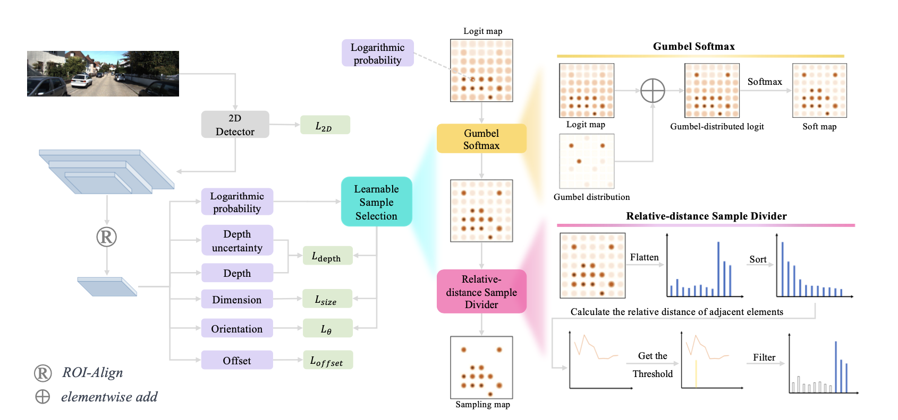

## MonoLSS: Learnable Sample Selection For Monocular 3D Detection

:fire::fire:**[3DV 2024]** The official implementation of the paper "[MonoLSS: Learnable Sample Selection For Monocular 3D Detection](https://arxiv.org/abs/2312.14474)"

:fire::fire:| [Paper](https://arxiv.org/abs/2312.14474) | [MonoLSS知乎解读](https://zhuanlan.zhihu.com/p/674862695) | [MonoLSS微信解读](https://mp.weixin.qq.com/s/NpLjZT2yuiV-dhIyTcdYRw)

## Abstract 

In the field of autonomous driving, monocular 3D detection is a critical task which estimates 3D properties (depth, dimension, and orientation) of objects in a single RGB image. Previous works have used features in a heuristic way to learn 3D properties, without considering that inappropriate features could have adverse effects. In this paper, sample selection is introduced that only suitable samples should be trained to regress the 3D properties. To select samples adaptively, we propose a Learnable Sample Selection (LSS) module, which is based on Gumbel-Softmax and a relative-distance sample divider. The LSS module works under a warm-up strategy leading to an improvement in training stability. Additionally, since the LSS module dedicated to 3D property sample selection relies on object-level features, we further develop a data augmentation method named MixUp3D to enrich 3D property samples which conforms to imaging principles without introducing ambiguity. As two orthogonal methods, the LSS module and MixUp3D can be utilized independently or in conjunction. Sufficient experiments have shown that their combined use can lead to synergistic effects, yielding improvements that transcend the mere sum of their individual applications. Leveraging the LSS module and the MixUp3D, without any extra data, our method named MonoLSS ranks 1st in all three categories (Car, Cyclist, and Pedestrian) on KITTI 3D object detection benchmark, and achieves competitive results on both the Waymo dataset and KITTI-nuScenes cross-dataset evaluation. The code is included in the supplementary material and will be released to facilitate related academic and industrial studies.

## Main results

## Dataset
Download the KITTI dataset from [**KITTI website**](https://www.cvlibs.net/datasets/kitti/index.php)
The directory will be as follows:

your_kitti_data  
    ├── ImageSets  

    ├── testing

        ├── calib

        ├── image_2

    ├── training

        ├── calib

        ├── image_2

        ├── label_2

        
Write the path to "data_dir" and "label_dir" in lib/kitti.yaml.

## Installation
Install the following environments:
~~~
python 3.7
torch 1.3.1
torchvision 0.4.2
~~~

## Eval
Download the checkpoint from [**Baidu**](https://pan.baidu.com/s/1C77fRo7FMeYtmKKcwXOtlQ?pwd=8848) or [**Google Drive**](https://drive.google.com/file/d/1Stoum9XZQIjUgLxNDZQqK6WuzSfxYpEK/view?usp=sharing)
~~~
python tools/train_val.py -t
~~~

## Train
~~~
python tools/train_val.py
~~~

The default lib/kitti.yaml is for train in trainval split and test in KITTI web. 

## citation
~~~
@misc{li2023monolss,
      title={MonoLSS: Learnable Sample Selection For Monocular 3D Detection}, 
      author={Zhenjia Li and Jinrang Jia and Yifeng Shi},
      year={2023},
      eprint={2312.14474},
      archivePrefix={arXiv},
      primaryClass={cs.CV}
}
~~~
## Acknowledgements
This respository is mainly based on [**GUPNET**](https://github.com/SuperMHP/GUPNet/tree/main) and [**DID-M3d**](https://github.com/SPengLiang/DID-M3D)
